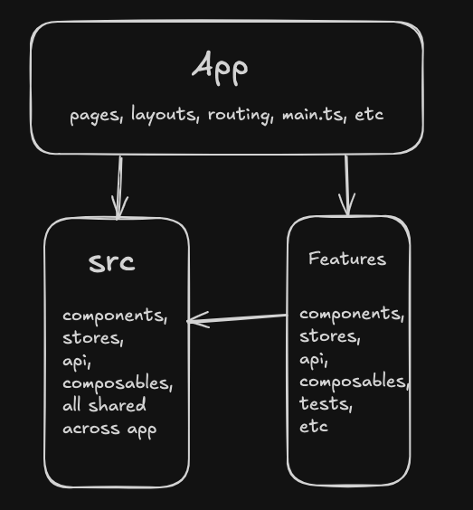

## Install:

1) Lokal DE
	- cd frontend, run `npm run dev`
	- cd backend, run `npm run devStart`
2) Containerized DE (ready for prod)
	- run Docker
	- run `docker-compose up --build`
3) Other:
	- `npm run lint`
	- `npm run test`

All changes are split into logical commits for easier reviewing.

## Time Spent:

- Project skeleton: 5 min (I got tired of the endless boilerplate for every new PoC, MVP, pet project or test task, so I built a template like a "plug and play" solution for all the frameworks that I use, with everything that you might need: architecture, stores, Element Plus, routing, layout, Vitest, etc. Btw, you can download my template from the 1st commit and use it for your own purposes :D )
- Create a REST API with 2 endpoints, write data-generators for unique data on Express.js: 20-30 min
- Configure data flow from back to front: 20-30 min
- Create graph components, create a patient card, create stores, create 2 unit tests :D, write mock-functions for default data, functions for calculation and clearing the interval for graphs: 1.5h
- Add light/dark mode and responsive layout: 30-40 min
- Containerization: 15 min All time for basic functionality: 3-3.5h

## Stack:

Vue3, TS, Express.js, Pinia, Echarts, Vue-router 4, Vite, Element Plus, Axios, ESLint, Prettier, Vitest, Happy Dom, Saas, nginx, Docker.

## Features:

* State Management: Pinia is fully configured.
- A global Axios instance is pre-configured with interceptors for handling requests and responses, located in `src/api/axiosInstance.ts`.
* Routing: Vue Router 4 is pre-configured with lazy imports and a default layout.
* Vite(Rolldown - new bundler on Rust)
* UI & Styling (Element Plus):
    * Optimized: It uses element-override.scss to import only the styles for components you actually use, keeping the bundle size down.
    * Customizable: All Element Plus styles can be easily and centrally overridden in the element-override.scss file.
* Global Styles: SCSS variables are configured in Vite and globally injected across the entire project, so you don't need to import them manually in every file.
* Testing: Vitest is integrated for unit and component testing and Happy Dom 
* Configured Prettier
* Configured ESLint (like linter!)
* Configured Boundaries like architecture guards
* CI Github actions predefined
* Frontend/backend are containerized  and ready for production 
* Node packets locked

## Template Architecture:

This template is based on my favorite feature-based architecture.

Instead of grouping code by its technical type (like `/components`, `/stores`, `/api`, etc.), we group all files related to a specific feature (a business logic unit).

In this project, patient and vitals are good examples — inside each feature, we have all related components, stores, composables, etc., that belong only to that feature. Only the feature layer contains business logic.

At the `/src` level, we have the shared layer of the app — it includes all shared components used across the project, the Axios instance, assets, store initializers for managing plugins and the store itself, etc.

The `/app` level is the top layer, containing the app skeleton (it initializes the app, routing, layouts, etc.).

By using ESLint boundaries, we define the data flow:

The App layer can consume data from anywhere in the app (src and features).

The Feature layer can consume from the src layer and itself (boundaries prevent it from importing other features).

The src layer can only use itself (it's shared layer).

What could be better:
- WebSockets && Postgres
- Auth for M.D && Patient with roles
- Add debounce for resizeChart.
- Add notifications/alerts for dangerous health conditions.
- Add export to CSV (token effective) and FHIR resource for using data for medical purposes.
- Add Gemini API to make a twice-daily request for summarization of the patient's state, and save it for future analysis in chunks.
- Add more test FE/BE
- Add more data
- Accessibility audit 
- Bundle audit (now 1.1 mb it's good result for this stuck)